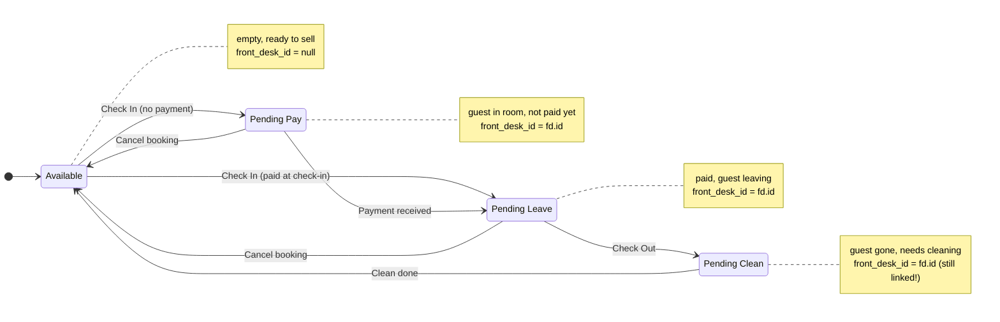
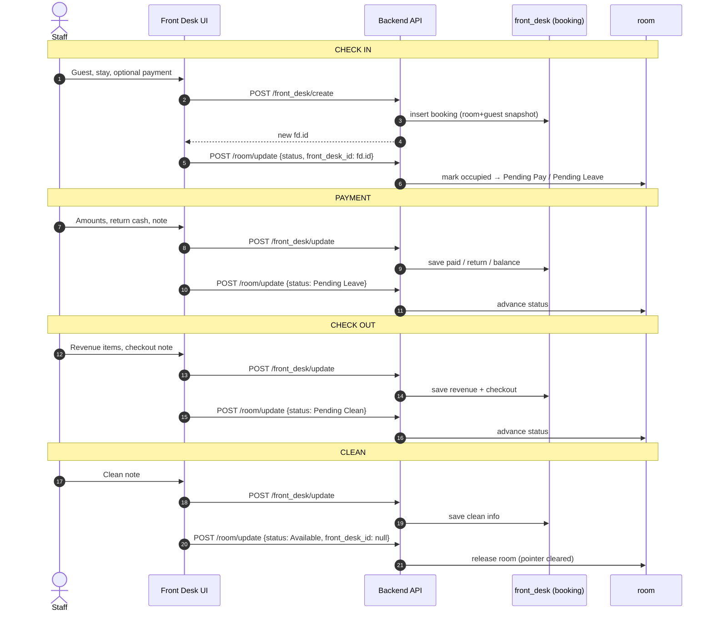
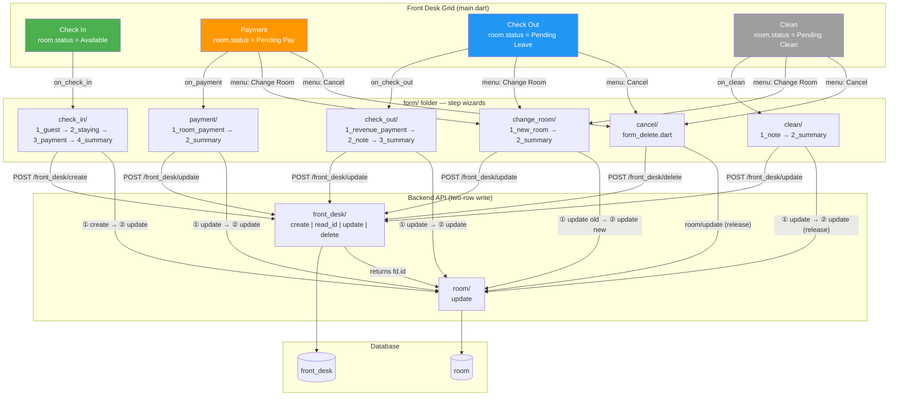
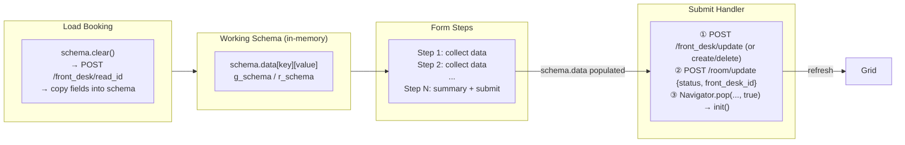
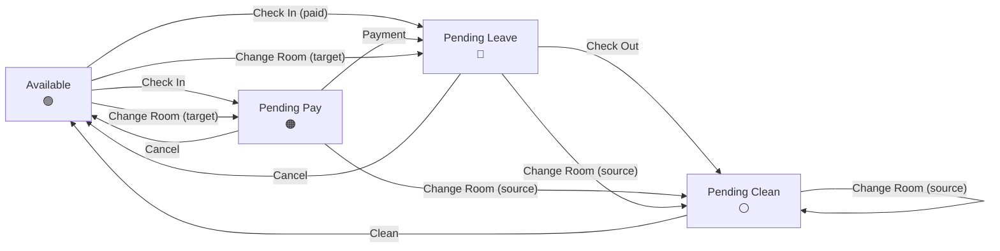

# Front Desk — Standard Process (Structure)

Goal: understand the full guest lifecycle (check-in → payment → check-out → clean → cancel) and how each form step works, so new features like **Change Room** / **Update Stay** can be built the same way.

## 1. Core idea

- `front_desk` = **one booking record**. It stores _denormalized snapshots_ of the room and guest (`room_number`, `room_kind`, `room_usd_per_day`, `guest_full_name`, ...) so the grid and summaries don't need joins.
- `room` = physical room. It holds a `status` plus a `front_desk_id` pointer to the **current** booking in it.

So every state change touches **two rows**:

1. `front_desk/update` — update the booking's data (or `create` on check-in)
2. `room/update` — move the room to its next status / update the pointer

## 2. Room status state machine



| Status          | Meaning                     | Front-desk grid section |
| --------------- | --------------------------- | ----------------------- |
| `Available`     | empty, ready to sell        | Check In                |
| `Pending Pay`   | guest in room, not paid yet | Payment                 |
| `Pending Leave` | paid, guest leaving         | Check Out               |
| `Pending Clean` | guest gone, needs cleaning  | Clean                   |

### Transitions in detail

| Transition                        | Trigger (button)            | API calls (order matters)                                         | room.status →     | room.front_desk_id →  |
| --------------------------------- | --------------------------- | ----------------------------------------------------------------- | ----------------- | --------------------- |
| `Available` → `Pending Pay`       | Check In (no payment)       | `front_desk/create` then `room/update`                            | `"Pending Pay"`   | `fd.id` (new booking) |
| `Available` → `Pending Leave`     | Check In (paid at check-in) | `front_desk/create` then `room/update`                            | `"Pending Leave"` | `fd.id` (new booking) |
| `Pending Pay` → `Pending Leave`   | Payment ("Paid")            | `front_desk/update` then `room/update`                            | `"Pending Leave"` | unchanged (`fd.id`)   |
| `Pending Leave` → `Pending Clean` | Check Out                   | `front_desk/update` then `room/update`                            | `"Pending Clean"` | unchanged (`fd.id`)   |
| `Pending Clean` → `Available`     | Clean                       | `front_desk/update` then `room/update`                            | `"Available"`     | `null` (released)     |
| `Pending Pay` → `Available`       | Cancel                      | `room/update` (+ `front_desk/delete` if using `form_delete.dart`) | `"Available"`     | `null` (released)     |
| `Pending Leave` → `Available`     | Cancel                      | `room/update` (+ `front_desk/delete` if using `form_delete.dart`) | `"Available"`     | `null` (released)     |

- **The `front_desk_id` pointer is only cleared on the final step** — check-out keeps it, clean (or cancel) releases it. So a `Pending Clean` room is still linked to its booking until someone clicks Clean.
- Cancel is currently **inconsistent**: the wired `on_cancel` in `main.dart` only does `room/update` (frees the room) and leaves the `front_desk` row in the DB; `form/cancel/form_delete.dart` deletes the booking but isn't connected to the grid.

### The two-row write pattern (sequence view)

This is the pattern to copy for any new action (Change Room, Update Stay, ...):
**① write the booking first, ② advance the room after.** Order matters — the `room/update` needs the `fd.id` produced by `front_desk/create`, and `front_desk/update` carries all the denormalized snapshots.



**How to read it:** every action is exactly two writes in the same order — `front_desk/…` first, then `room/update`. The only differences are *which* booking fields change and *which* status the room moves to. Change Room is the same shape, but swaps the room snapshot + repoints `front_desk_id` from old room → new room.

> Note: `main.dart` filters rooms by exact string status, e.g. `r[r_schema.STATUS] == "Pending Pay"`. Keep the strings identical everywhere.

## 3. Grid → action mapping (main.dart)

Each colored section lists the rooms whose `status` matches, and each room button opens a menu of actions:

| Section   | Filter (room.status) | Default action (button tap) | Menu actions                                                            |
| --------- | -------------------- | --------------------------- | ----------------------------------------------------------------------- |
| Check In  | `Available`          | `on_check_in`               | Status (todo)                                                           |
| Payment   | `Pending Pay`        | `on_payment`                | Summary, Change Room, Update Stay, Update Guest, Update Revenue, Cancel |
| Check Out | `Pending Leave`      | `on_check_out`              | Summary, Change Room, Update Revenue, Update Stay, Update Guest, Cancel |
| Clean     | `Pending Clean`      | `on_clean`                  | Summary, Change Room, Update Stay, Update Guest, Cancel                 |

All `on_*` handlers follow the same pattern:

1. `schema.clear(); g_schema.clear(); r_schema.clear();` — reset the working schemas
2. `POST /front_desk/read_id {_id: r[FRONT_DESK_ID]}` — load the booking
3. copy each field into `schema.data[key]["value"]`
4. `Navigator.push` to a form page
5. on return: `init()` to reload rooms, and pop the pushed pages

## 4. Feature flows (form/ folder)

### Check In — `form/check_in/` (4 steps, wizard)

1. `1_guest.dart` — search/select guest (writes `guest_id`, `guest_full_name`, ... into schema)
2. `2_staying.dart` — number of guests, stay days + hours, note.
   - **Pricing is computed here**: `room_price_total_usd = (stay_days * room_usd_per_day) + ((stay_hours / 3) * room_usd_per_3h)`
   - Server time via `POST /setting/now`; sets `check_in_at`, `check_out_date = now + (days, hours)`, `check_in_by_id/by`
3. `3_payment.dart` — optional payment at check-in (same fields as the Payment flow)
4. `4_summary.dart` — shows all fields; **Check In** button:
   - `POST /front_desk/create` with all schema fields
   - `status = "Pending Pay"` (or `"Pending Leave"` if `room_paid_at` is set)
   - `POST /room/update {id, status, front_desk_id: <new fd id>}`
   - pops 4 pages, refreshes grid

### Payment — `form/payment/` (2 steps)

1. `1_room_payment.dart` — editable room price, paid bank/cash (USD + KHR), return cash; live-computes `room_paid_total_usd`, `room_balance_total_usd`, sets `room_paid_by/at/note`
2. `2_summary.dart` — **Paid** button:
   - `POST /front_desk/update` (all fields)
   - `POST /room/update {id, status: "Pending Leave"}`
   - pops 2 pages, refreshes grid

### Check Out — `form/check_out/` (3 steps)

1. `1_revenue_payment.dart` — settle extra revenue (souvenirs, minibar, ...) with the same bank/cash/return pattern (`revenue_*` fields)
2. `2_note.dart` — checkout note
3. `3_summary.dart` — **Check Out** button:
   - `POST /front_desk/update` (all fields, incl. `check_out_at/by/note`)
   - `POST /room/update {id, status: "Pending Clean"}`
   - pops 3 pages, refreshes grid

### Clean — `form/clean/` (2 steps)

1. `1_note.dart` — clean note (`clean_by/at` set)
2. `2_summary.dart` — **Clean** button:
   - `POST /front_desk/update` (all fields)
   - `POST /room/update {id, status: "Available", front_desk_id: null}` ← room released back to pool
   - pops 2 pages, refreshes grid

### Cancel — `form/cancel/form_delete.dart` (standalone)

- `POST /front_desk/delete {_id}` then pop.
- Note: the current `on_cancel` in `main.dart` **doesn't** use this form — it only shows a confirm dialog, releases the room inline (`status: "Available"`, `front_desk_id: null`), and does **not** delete the booking. `form_delete.dart` exists but isn't wired to the grid yet.

## 5. Pricing model (source of truth)

```dart
room_price_total_usd = (stay_day * usd_per_day) + ((stay_hour / 3) * usd_per_3h)
```

- `stay_hour` is a multiple of 3 (options `[0, 3, 6, 9, 12, ...]`).
- Payment fields exist in 4 combos: bank/cash × USD/KHR.
- Totals: `room_paid_total_usd` (paid), `room_return_total_usd` (change), `room_balance_total_usd` (remaining due).
- All money is stored per-field; derived totals are saved back to the schema, not computed on read.

## 6. Data model

### `room`

| field           | type   | notes                                |
| --------------- | ------ | ------------------------------------ |
| `_id`           | id     |                                      |
| `number`        | string | shown on buttons                     |
| `usd_per_day`   | number |                                      |
| `usd_per_3h`    | number |                                      |
| `kind`          | string | room type                            |
| `status`        | string | state machine above                  |
| `note`          | string |                                      |
| `front_desk_id` | id     | current booking, null when available |

### `front_desk` (grouped)

| group          | fields                                                                                                                         |
| -------------- | ------------------------------------------------------------------------------------------------------------------------------ |
| Room snapshot  | `room_id`, `room_number`, `room_kind`, `room_usd_per_3h`, `room_usd_per_day`                                                   |
| Guest snapshot | `guest_id`, `guest_full_name`, `guest_gender`, `guest_phone_number`, `guest_nationality`                                       |
| Stay           | `stay_day`, `stay_hour`, `number_of_guests`, `check_out_date`, `check_in_note`, `check_in_by_id`, `check_in_by`, `check_in_at` |
| Room money     | `room_price_total_usd`, `room_paid_*` (bank/cash, usd/khr, total, by, at, note), `room_return_*`, `room_balance_total_usd`     |
| Revenue money  | `revenue_price_total_usd`, `revenue_paid_*`, `revenue_return_*`, `revenue_balance_total_usd`                                   |
| Check out      | `check_out_note`, `check_out_by_id`, `check_out_by`, `check_out_at`                                                            |
| Clean          | `clean_note`, `clean_by_id`, `clean_by`, `clean_at`                                                                            |

## 7. Pattern for adding a new action (e.g. Change Room)

Follow the check-in wizard pattern:

```
form/change_room/
  1_new_room.dart     // pick an Available room (reuse room grid)
  2_summary.dart      // confirm; submit button
```

Submit handler should:

1. Load the booking: `POST /front_desk/read_id {_id: r[FRONT_DESK_ID]}`
2. **Old room**: `POST /room/update {id: old, status: "Pending Clean", front_desk_id: null}`
3. **New room**: `POST /room/update {id: new, status: <current stage: "Pending Pay" | "Pending Leave">, front_desk_id: fd_id}`
4. **Booking**: `POST /front_desk/update` with the 5 room-snapshot fields (`room_id`, `room_number`, `room_kind`, `room_usd_per_3h`, `room_usd_per_day`)
5. If rates differ → recalc `room_price_total_usd` / `room_balance_total_usd` (business decision: keep original rate or recompute from `check_in_at`)
6. Log who/when (add `change_room_*` fields or append to `check_in_note`)
7. `Navigator.pop(..., true)` → `init()` to refresh the grid

### Checklist for a new feature

- [ ] New folder under `form/` with numbered step files, each with its own `main()`
- [ ] Wire the handler in `main.dart` (schema.clear → read_id → copy → push → init)
- [ ] Add menu item in the relevant grid sections
- [ ] Use `dio.post` with `FormData`/map + try/catch + `snackbar.view`
- [ ] Add new schema fields (if any) to `schema.g.dart` + constant, and backend endpoint support

## 8. Overall system structure (mermaid)



### Data flow summary



### Room status lifecycle (compact)




